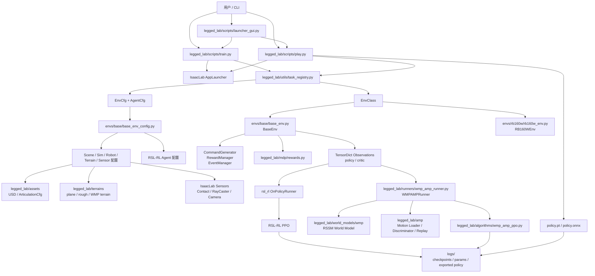
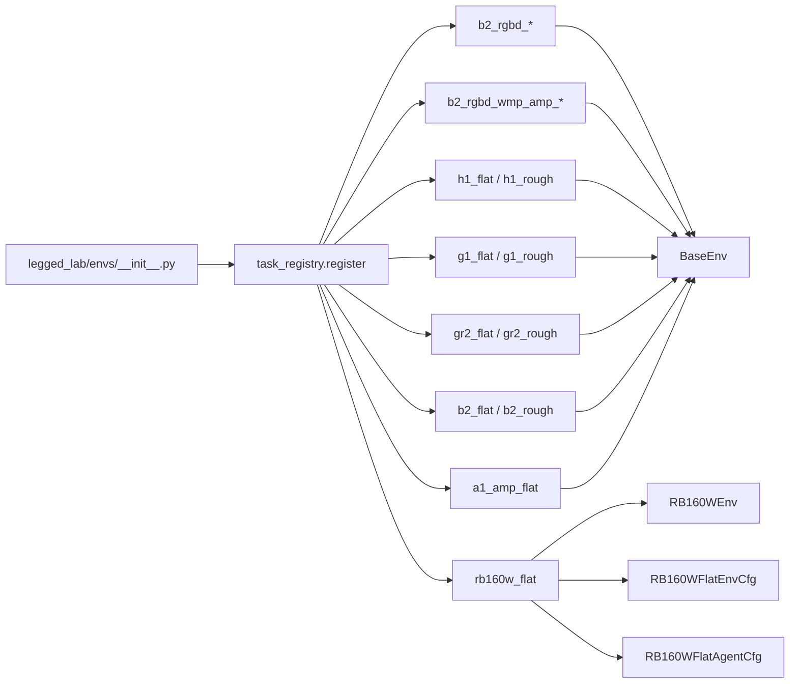
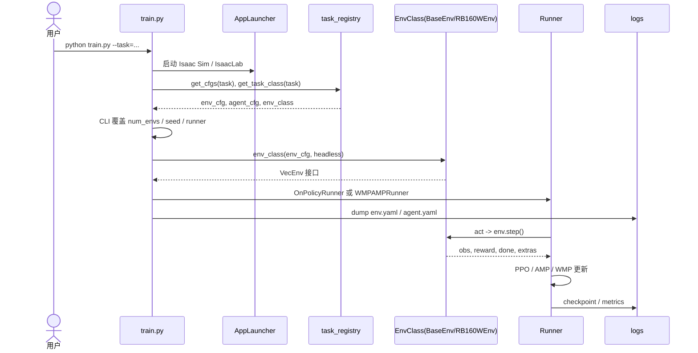
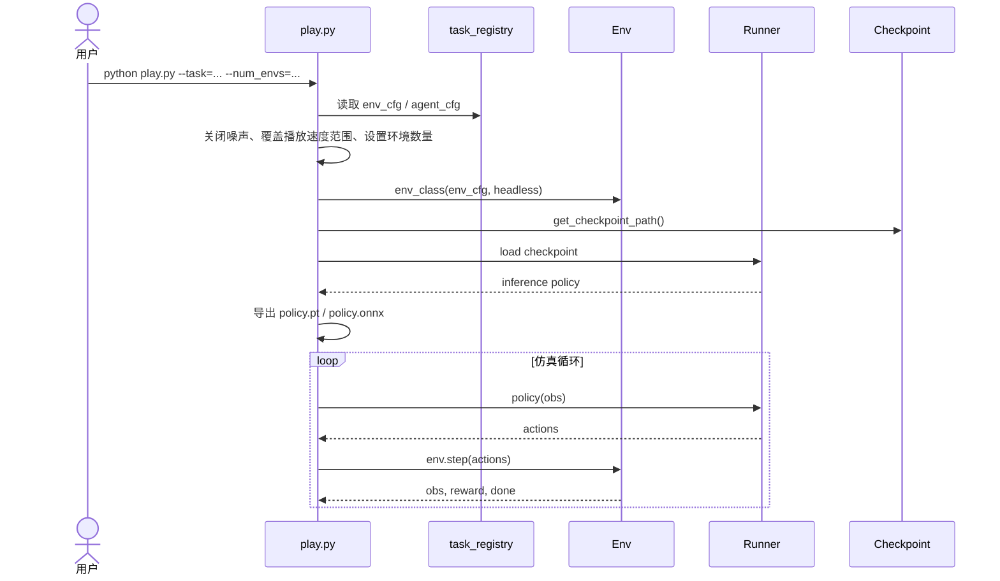
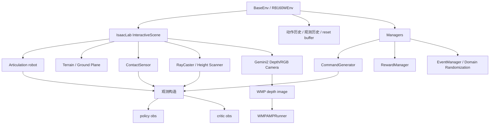
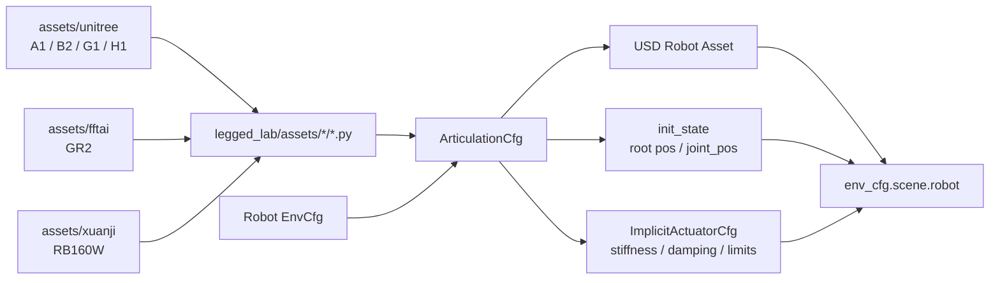

# LeggedLab 系统架构图

本文档基于当前项目结构生成，重点描述训练、播放、任务注册、环境、资产、Runner、WMP/AMP 扩展之间的关系。

## 总览



## 任务注册关系



## 训练流程



## 播放流程



## 环境内部结构



## 资产与机器人配置



## WMP + AMP 扩展链路

```mermaid
flowchart TB
    Env[BaseEnv with RGBD] --> Depth[Gemini2 depth]
    Env --> Prop[get_wmp_proprioception]
    Env --> AMPObs[get_amp_observations]

    Depth --> Pre[depth_to_wmp_image<br/>64x64x1 NHWC]
    Pre --> WM[WorldModel RSSM]
    Prop --> WM
    WM --> Feature[WMP feature<br/>deter=512 / full=1536]

    Feature --> ObsAug[obs['wmp']]
    Env --> BaseObs[policy / critic obs]
    BaseObs --> ObsAug

    AMPObs --> Discriminator[AMPDiscriminator]
    Motion[AMP motion files<br/>datasets/wmp_mocap_motions] --> Loader[AMPLoader]
    Loader --> Discriminator

    ObsAug --> Algo[WMPAMPPPO]
    Discriminator --> AMPReward[AMP reward]
    AMPReward --> Algo
    Algo --> Rollout[RolloutStorage]
    WM --> Replay[WMPReplayBuffer<br/>replay_capacity]
    Replay --> WMTrain[World model train step]
```

## 关键目录职责

```text
legged_lab/scripts
  train.py / play.py / launcher_gui.py / inspect_* / preview_*

legged_lab/envs
  任务注册、各机器人 EnvCfg / AgentCfg、BaseEnv、RB160WEnv

legged_lab/assets
  机器人 USD 资产路径、初始姿态、执行器配置

legged_lab/mdp
  reward 函数和 MDP 相关计算

legged_lab/runners
  默认 rsl_rl 之外的 AMP / WMP-AMP runner

legged_lab/algorithms
  AMP-PPO、WMP-AMP-PPO 算法封装

legged_lab/amp
  AMP motion dataset、判别器、normalizer、replay buffer

legged_lab/world_models/wmp
  WMP/RSSM world model、encoder/decoder、replay buffer、depth preprocess

legged_lab/terrains
  rough terrain、ray caster、WMP terrain 相关配置和生成器

legged_lab/utils
  task_registry、CLI 参数、rsl_rl 版本兼容、键盘控制、scene 工具
```

